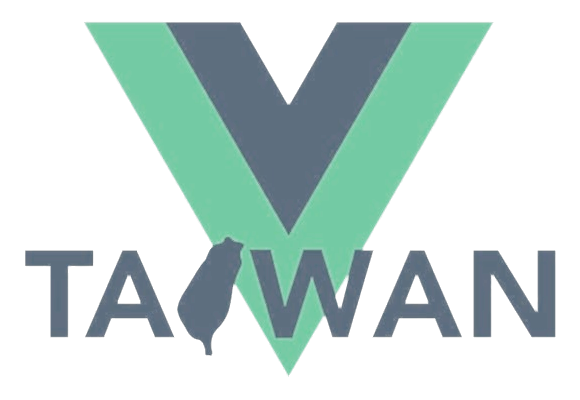

<h1 align="center">mazely-v-conf</h1>

<p align="center">
  
  &emsp;<big><strong>×</strong></big>&emsp;&nbsp;
  
</p>

<p align="center">
  Interactive 3D Vue and Vite logo mazes, powered by Mazely.
</p>

<p align="center">
  <a href="https://v-conf.mazely.dev">Live Demo</a> ·
  <a href="https://v-conf.vue.tw/">V-CONF Taiwan</a> ·
  <a href="https://mazely.dev">Mazely Docs</a> ·
  <a href="https://github.com/wujue0115/mazely">Mazely GitHub</a>
</p>

## About

`mazely-v-conf` is a promotional page created for V-CONF, featuring the Vue and
Vite logos as interactive 3D mazes. Each maze appears cell by cell as blocks
fall into place and gradually reveal the selected logo.

**Mazely** handles the maze generation, while Three.js turns
each generation step into the animated scene.

## Experience

* Switch between Vue and Vite logo mazes
* Watch every maze form step by step in 3D
* Select start and destination cells to animate a route through the maze
* Try Recursive Backtracker, Randomized Prim, and Randomized Kruskal
* Play, pause, regenerate, focus, rotate, and zoom
* Adjust route selection, maze size, and block appearance
* Enjoy responsive Vue and Vite visual themes on desktop and mobile

## How It Works

```text
Vue / Vite Logo
      ↓
   Cell Mask
      ↓
    Mazely
      ↓
Generation Steps
      ↓
   Three.js
      ↓
3D Falling Blocks
      ↓
Start / Destination
      ↓
 Animated Route
```

The logo defines the shape, Mazely generates a valid maze inside it, and Three.js
reveals the result one falling block at a time. After generation, selecting a
start and destination visualizes the solved route directly on the 3D maze.

## Mazely

Mazely is an open-source TypeScript library for maze
generation, pathfinding, editing, and visualization.

* [Documentation](https://mazely.dev)
* [Mazely Studio](https://studio.mazely.dev)
* [GitHub](https://github.com/wujue0115/mazely)

## Changelog

Project updates are recorded in [CHANGELOG.md](./CHANGELOG.md).

## Contributing

See [CONTRIBUTING.md](./CONTRIBUTING.md) for the development and review workflow.
Repository maintainers can also reference the documented
[branch protection rules](./.github/BRANCH_PROTECTION.md).

## License

[MIT](LICENSE) Copyright (c) 2026-PRESENT Wujue.
